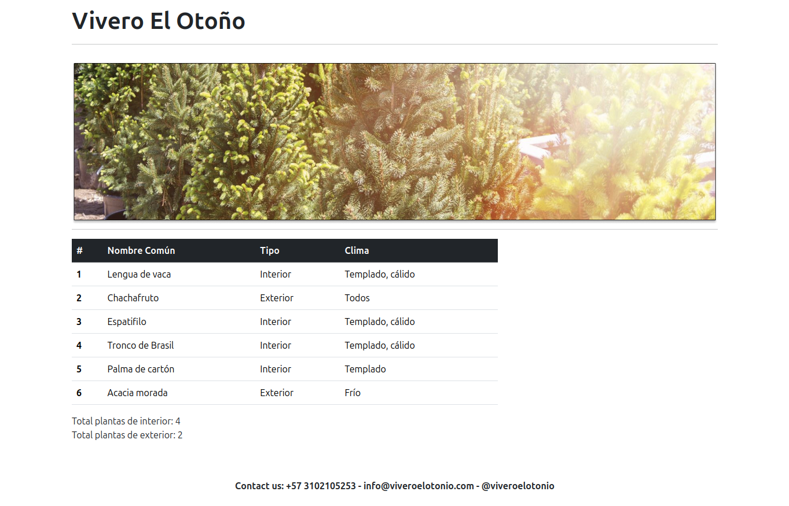

# Evaluación Práctica - MISW-4104

## Descripción

Este proyecto corresponde a la evaluación práctica del curso **MISW-4104**.  
Consiste en una aplicación Angular que muestra un listado de plantas en venta, utilizando:
- Un **módulo** específico para plantas
- Una **clase `Planta`** que modela los datos
- Un **servicio HTTP** para consumir un archivo JSON
- Un **componente** que despliega la información en una **tabla de Bootstrap**

También se implementa el **conteo de plantas por tipo** y se desarrollaron **pruebas unitarias** para el componente. Todo el trabajo fue gestionado mediante GitHub, siguiendo las instrucciones de la evaluación.


### Vista de la Aplicación




## Instalación

Clona el repositorio o descomprime el ZIP adjunto. Luego, dentro de la carpeta del proyecto, ejecuta:

```bash
npm install
ng serve
```

> Recuerda que necesitas tener instalado previamente el **Angular CLI** (`npm install -g @angular/cli`).

Accede a la aplicación en: [http://localhost:4200/](http://localhost:4200/)


## Testing

Para ejecutar los tests:

```bash
npm run test    # Usa Chrome si está disponible
ng test         # Alternativa si no tienes Chrome instalado
```


## Recursos

- **Mockup de diseño**:  
  [Figma - Mockups evaluación MISW-4104](https://www.figma.com/design/5NjgSjCs395umb40EEQpQW/Monitoria-MISW---Mockups-parcial-1B?node-id=3-91&p=f&t=LEfxsrLJX8duVNln-0)

- **Fuente de datos (JSON)**:  
  [Plantas JSON - GitHub Gist](https://gist.githubusercontent.com/josejbocanegra/7b71922ee9e2ab407d3210f1e5cb8400/raw/cf1077fa69112bc67ff520dd6517a93afd3dae29/202212_MISW4104_Grupo2.json)
